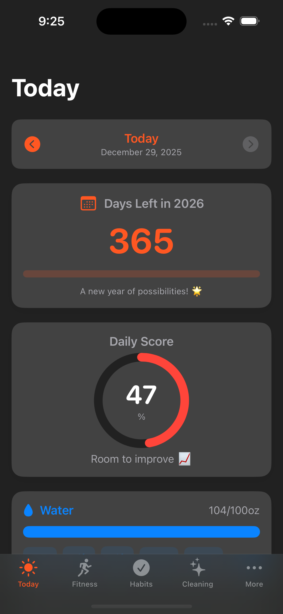
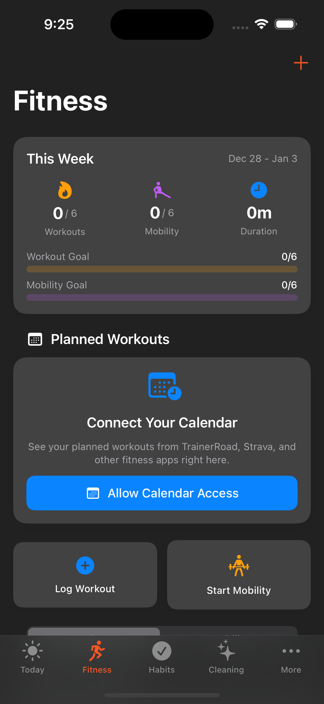
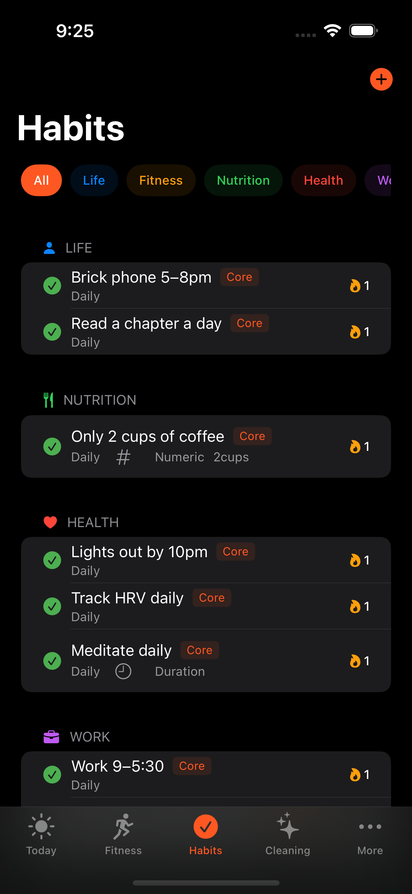
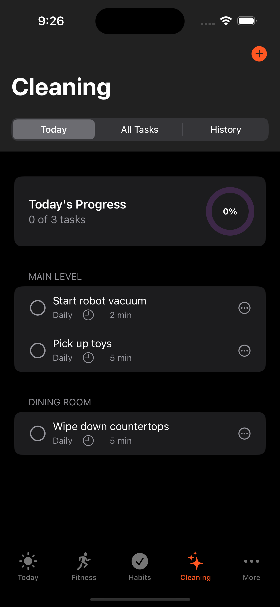
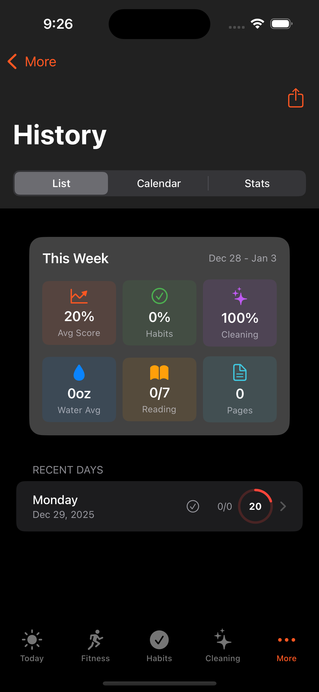
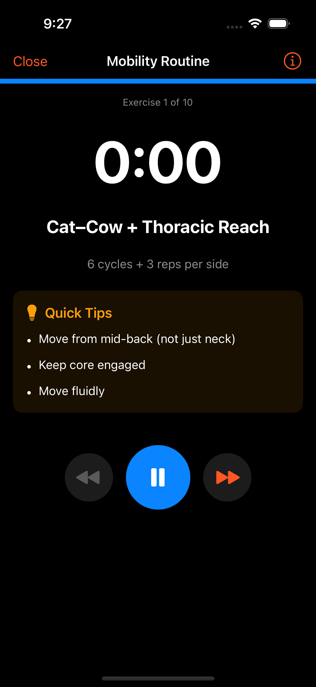

# Project 2026 🎯

<p align="center">
  
</p>

<p align="center">
  <strong>A personal life OS to make 2026 your best year yet</strong>
</p>

<p align="center">
  <em>100% built with VS Code and GitHub Copilot's Agent Mode</em>
</p>

---

## ✨ Overview

Project 2026 is a comprehensive iOS app designed to transform long-term goals into a daily executable system. It reduces decision fatigue by providing structured routines for habits, cleaning tasks, fitness tracking, and personal reflection—all in one beautiful, dark-mode interface.

### 🎬 Demo Videos

| Feature | Video |
|---------|-------|
| 📱 Full App Tour | [Watch Demo](Docs/Videos/project2026-app-demo.mp4) |
| 💪 Fitness Tab | [Watch Demo](Docs/Videos/fitness-tab-demo.mp4) |
| 🧘 Mobility Routine | [Watch Demo](Docs/Videos/mobility-routine-demo.mp4) |
| 📺 tvOS Support | [Watch Demo](Docs/Videos/tvos-mobility-demo.mp4) |

---

## 📱 Screenshots

<p align="center">
  
  
  
</p>

<p align="center">
  
  
  
</p>

---

## 🚀 Features

### 📅 **Today Dashboard**
Your command center for the day. At a glance, see:
- **Days left in 2026** countdown with motivational messages
- **Daily Score** ring showing your completion percentage
- **Water Tracking** with quick-add buttons (+8oz, +12oz, +16oz, etc.)
- **Reading Progress** to track your daily chapter goal
- **Habits Checklist** organized by category
- **Cleaning Tasks** for the day
- **Mobility Routine** launcher

### 💪 **Fitness Tracking**
- Log workouts with type, duration, and notes
- Track weekly workout and mobility goals (6x/week)
- Calendar integration for planned workouts from TrainerRoad, Strava, etc.
- Quick-start mobility routines

### 🧘 **Guided Mobility Routine**
A complete 10-exercise mobility sequence with:
- Timer for each exercise
- Quick tips and form cues
- Progress tracking through the routine
- Skip forward/back between exercises

### ✅ **Habit Management**
- **Core Habits** pre-configured for health, nutrition, work, and recovery
- **Custom Habits** with flexible input types (boolean, numeric, duration)
- Category-based organization (Life, Fitness, Nutrition, Health, Work, Supplements)
- Streak tracking with fire emoji indicators 🔥

### 🧹 **Cleaning Rotation**
Never wonder what to clean again:
- Smart task surfacing (1-3 daily tasks)
- Room-based organization
- Estimated time per task
- Defer option for flexibility
- Progress tracking

### 📊 **History & Analytics**
- Weekly summary with averages
- Track habits, cleaning, water, and reading
- Daily score history
- Export functionality for ChatGPT review summaries

### 💧 **Water Tracking**
- Daily target (100oz default)
- Quick-add buttons for common amounts
- Visual progress bar
- Counts toward daily habit completion

### 📚 **Reading Tracker**
- Add books with title, author, and page count
- Log reading sessions
- Track progress percentage
- Supports the "Read a chapter a day" habit

---

## 🏗️ Architecture

Built with modern iOS development practices:

- **Swift 6.1+** with strict concurrency
- **SwiftUI** with Model-View (MV) pattern
- **Swift Package Manager** for modular code organization
- **@Observable** and native SwiftUI state management
- **Swift Testing** framework for comprehensive tests
- **Async/await** throughout, no completion handlers

### Multi-Platform Support
- 📱 **iOS** - Primary experience
- 🖥️ **macOS** - Native Mac app
- 📺 **tvOS** - Living room mobility routines

### 📺 tvOS App

<p align="center">
  
</p>

The tvOS app brings guided mobility routines to your living room with a TV-optimized interface perfect for following along during stretching sessions.

---

## 🤖 Built with AI

This entire application was **100% built using VS Code and GitHub Copilot's Agent Mode**.

### Development Workflow
1. **Planning** - Used Copilot to help architect the app structure and data models
2. **Implementation** - Agent mode wrote all Swift/SwiftUI code
3. **Testing** - Copilot generated comprehensive test suites
4. **Debugging** - AI-assisted debugging and error resolution
5. **Documentation** - README and code comments generated by Copilot

### Tools Used
- **Visual Studio Code** with Swift extension
- **GitHub Copilot** (Agent Mode)
- **XcodeBuildMCP** for build automation and simulator control
- **Swift Package Manager** for dependency management

---

## 🎯 Goals

Project 2026 is built around these high-level life goals:

1. **Be more present** and enjoy the time you have
2. **Live a healthy life** through consistent habits
3. **Enjoy the outdoors** and local adventures

### Key Performance Indicators (KPIs)
- 🚴 **Cycling**: Reach 250 FTP
- ⛷️ **Skiing**: Ski every SLC resort, ski 50 days
- 📱 **Digital Wellness**: Under 1 hour phone usage/day

---

## 📋 Core Habits

The app comes pre-configured with science-backed habits:

| Category | Habits |
|----------|--------|
| **Life** | Brick phone 5-8pm, Read a chapter daily |
| **Fitness** | Workout 6x/week, Mobility 6x/week |
| **Nutrition** | 100oz water, Minimize processed foods, 2 cups coffee max, 145g protein |
| **Health** | Lights out by 10pm, Track HRV, Meditate daily |
| **Work** | Work 9-5:30, Limit social media to 15 min |
| **Recovery** | Wake at 5:30am, Multivitamin, Hot tub, Daily mobility |

---

## 🛠️ Getting Started

### Prerequisites
- Xcode 16.0+
- iOS 18.0+ / macOS 15.0+ / tvOS 18.0+
- Swift 6.1+

### Installation

1. Clone the repository:
```bash
git clone https://github.com/pierceboggan/pierceapp.git
cd pierceapp
```

2. Open the workspace:
```bash
open Project2026.xcworkspace
```

3. Select your target device and run!

---

## 📁 Project Structure

```
pierceapp/
├── Project2026/              # iOS app shell
│   ├── Views/                # SwiftUI views
│   ├── Models/               # Data models
│   └── Services/             # Business logic
├── Project2026Mac/           # macOS app
├── Project2026TV/            # tvOS app
├── Project2026Package/       # Shared Swift Package
├── Project2026Tests/         # Unit tests
└── Docs/
    ├── Screenshots/          # App screenshots
    └── Videos/               # Demo videos
```

---

## 🧪 Testing

Run tests using Swift Testing framework:

```bash
# From VS Code with XcodeBuildMCP
# Or using xcodebuild:
xcodebuild test -workspace Project2026.xcworkspace -scheme Project2026 -destination 'platform=iOS Simulator,name=iPhone 16'
```

---

## 📄 License

This project is for personal use.

---

## 🙏 Acknowledgments

- Built entirely with **GitHub Copilot Agent Mode** in **VS Code**
- Inspired by the desire to make 2026 an exceptional year
- Mobility routine based on cycling-specific flexibility needs

---

<p align="center">
  <strong>Make 2026 your best year yet! 🚀</strong>
</p>
